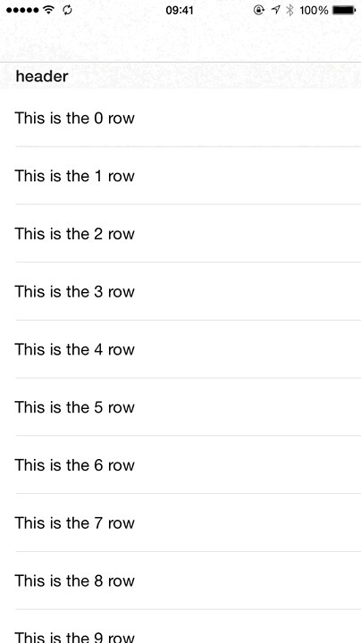

# SwipeableCell

## Preview



## Usage

### Installation

copy `SwipeableCell.h`, `SwipeableCell.m` into your project.


Add the following import to the top of the file:

``` objc
#import "SwipeableCell.h"
```

### Configuration

``` objc
#import "SwipeableCell.h"
#import "ViewController.h"

@interface ViewController () <SwipeableCellDelegate, SwipeableCellDataSource, UIGestureRecognizerDelegate>
@property (nonatomic, strong) NSMutableArray *isEditing;
@property (strong) UIView *maskView;
@end

static NSString * const cellIdentifier = @"swipetablecell";

@implementation ViewController

- (void)viewDidLoad {
    [super viewDidLoad];
    [self initView];
}

- (void)initView {
    [self.tableView registerClass:[SwipeableCell class] forCellReuseIdentifier:cellIdentifier];
    self.isEditing = [NSMutableArray array];
}

- (BOOL)gestureRecognizer:(UIGestureRecognizer *)gestureRecognizer shouldRecognizeSimultaneouslyWithGestureRecognizer:(UIGestureRecognizer *)otherGestureRecognizer {
    return YES;
}

- (NSInteger)numberOfSectionsInTableView:(UITableView *)tableView {
    return 1;
}

- (CGFloat)tableView:(UITableView *)tableView heightForRowAtIndexPath:(NSIndexPath *)indexPath {
    return 60.0f;
}

- (NSInteger)tableView:(UITableView *)tableView numberOfRowsInSection:(NSInteger)section {
    return 10;
}

- (UITableViewCell *)tableView:(UITableView *)tableView cellForRowAtIndexPath:(NSIndexPath *)indexPath {
    SwipeableCell *cell = [tableView dequeueReusableCellWithIdentifier:cellIdentifier forIndexPath:indexPath];
    cell.customLabel.text = [NSString stringWithFormat:@"This is the %ld row", (long)indexPath.row];
    cell.dataSource = self;
    cell.delegate = self;
    [cell setNeedsUpdateConstraints];
    if ([self.isEditing containsObject:indexPath]) {
        [cell openCell:NO];
    }
    return cell;
}

- (BOOL)tableView:(UITableView *)tableView canEditRowAtIndexPath:(NSIndexPath *)indexPath {
    return NO;
}

- (void)tableView:(UITableView *)tableView didSelectRowAtIndexPath:(NSIndexPath *)indexPath {

}

- (NSInteger)numberOfButtonsInSwipeableCell:(SwipeableCell *)cell {
    return 3;
}

- (NSString *)swipeableCell:(SwipeableCell *)cell titleForButtonAtIndex:(NSInteger)index {
    NSString *res;
    if (index == 0) {
        res = @"third";
    } else if (index == 1) {
        res = @"second";
    } else {
        res = @"first";
    }
    return res;
}

- (UIImage *)swipeableCell:(SwipeableCell *)cell imageForButtonAtIndex:(NSInteger)index {
    NSString *res;
    if (index == 0) {
        res = @"copy";
    } else {
        res = @"qrcode";
    }
    return [UIImage imageNamed: res];
}

- (UIColor *)swipeableCell:(SwipeableCell *)cell backgroundColorForButtonAtIndex:(NSInteger)index {
    UIColor *res;
    if (index == 0) {
        res = [UIColor blackColor];
    } else if (index == 1) {
        res = [UIColor grayColor];
    } else {
        res = [UIColor lightGrayColor];
    }
    return res;
}

- (UIColor *)swipeableCell:(SwipeableCell *)cell tintColorForButtonAtIndex:(NSInteger)index {
    return [UIColor whiteColor];
}

- (void)swipeableCell:(SwipeableCell *)cell didSelectButtonAtIndex:(NSInteger)index {

}

-(void)onTapHandle:(UITapGestureRecognizer *)sender{
    self.navigationController.navigationBar.hidden = NO;
    [UIView animateWithDuration: .5 animations:^{
        self.maskView.alpha = 0;
    } completion:^(BOOL finished) {
        [self.maskView removeFromSuperview];
    }];
}

- (void)swipeableCellDidOpen:(SwipeableCell *)cell {
    NSIndexPath *indexPath = [self.tableView indexPathForRowAtPoint:cell.center];
    [self.isEditing addObject:indexPath];
}

- (void)swipeableCellDidClose:(SwipeableCell *)cell {
    NSIndexPath *indexPath = [self.tableView indexPathForRowAtPoint:cell.center];
    [self.isEditing removeObject:indexPath];
}

- (NSString *)tableView:(UITableView *)tableView titleForHeaderInSection:(NSInteger)section {
    return @"header";
}

@end

```

## License

The MIT License (MIT)

Copyright (c) 2015 xdf
